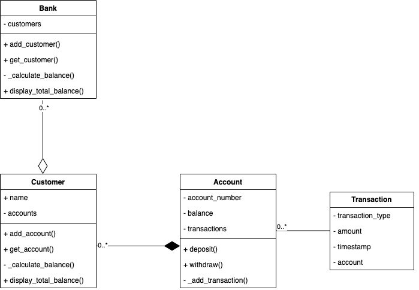

# Banking in OOP

## 1. Introduction

This repository shows a simple banking app written in Python, OOP-style.

The repository structure and brief description is as follows:

```
bank_app 
    |--src: contains files representing a bank and its entities
    |--static: contains static files supporting the app/readme
    |--tests: tests against src/, with each test file having an equivalent file in src/
app.py: entrypoint into the app, shows a bank running, including a test scenario
README.md 
```

## 2. Running the app and tests

To run this app:
1. [Install python](https://www.python.org/downloads/), any version >= 3.6 works. Standard libraries are used here, so no need to install additional ones.
2. Run `python3 app.py` inside the root directory

To run tests:
- We use the `unittest` module for this app
- Run `python3 -m unittest discover tests` inside root to run all of the tests in the `tests/` folder
- Run `python3 -m unittest test.test_bank_entities` to run a specific test file

## 3. Design and Analysis

#### 3.1 The App
The UML diagram for our app is below:



Internal methods used like `__str__` or `@property` getters and setters are ommitted for simplicity.

This app supports the basic requirements listed, which are the ability to: 1.) have multiple customers in a bank, 2.) withdraw, deposit and check balance against an account legitimately, and return total balances across accounts and customers.

I heavily use composition: a bank composes of customers, who then own accounts, where transactions against each account are logged by a transaction object. Due to composition, customers can only interact with accounts they own, and aggregating information is easy (i.e. several account balances aggregate up all the way up to a bank balance).

I then encapsulate information to protect it. For example, an account instance encapsulates its number, balance and transactions. A customer instance encapsulates its total balance and list of accounts. Most variables are private and where mutable, have getters and setters so we can extend to perform additional validation (i did minimal input validation where relevant via `assert()` methods here), or authentication checks in the future. I would also have invested more time into Exception raising/handling in a mature application.

Each class is constructed with as much of the SOLID principles in mind, so that they can subclassed to their specific entities, or made to be an interface, depending on the requirement. In a future scenario, where the factory pattern applies for example, we'd have:
- `Bank` can have certain bank branches
- `Customer` can be a `ChildCustomer`, `AdultCustomer`, `BusinessCustomer`, etc
- `Account` can be `SavingsAccount`, `CheckingAccount`, etc

An improvement for the future would be to ensure each entity (i.e. class) is represented by an ID, and there are checks per entity instantiation that avoid duplication. Another would be to add activities to list and decomission (i.e. remove) entities per class where relevant (i.e. a function to list customer accounts, or a function to close an account). Abilities to transact across entities would be great too (i.e. transfer money across accounts, or across customers). The wishlist can grow infinitely if we add auth considerations too, and concurrency requirements.

A sidenote on the file/folder structure, as the number of entities in our bank balloons, we can split the entities into their own files/subfolders.

#### 3.2 The Tests

I use `unittests` to write our tests, with each class in `src/` having its equivalent test class in  `tests/`. `unittests` is a test runner that allows you to either run global or specific test files. 

A tradeoff I made given time constraints is I wrote mostly positive unit tests per function (that isn't a property or an internal python function). These test the desired behaviour of each capability, and test for only one input type. Time-permitting, I'd test for multiple input types and include negative tests, boundary tests, exception unit tests and integration tests.